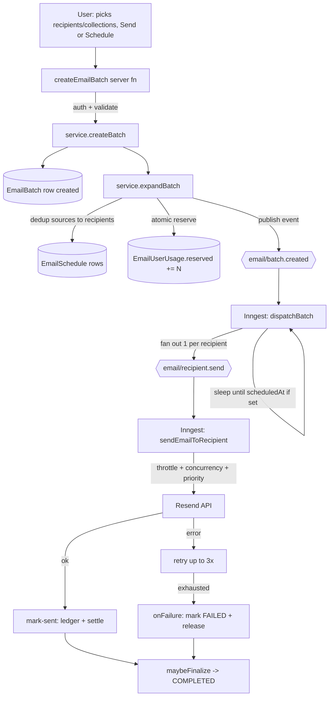
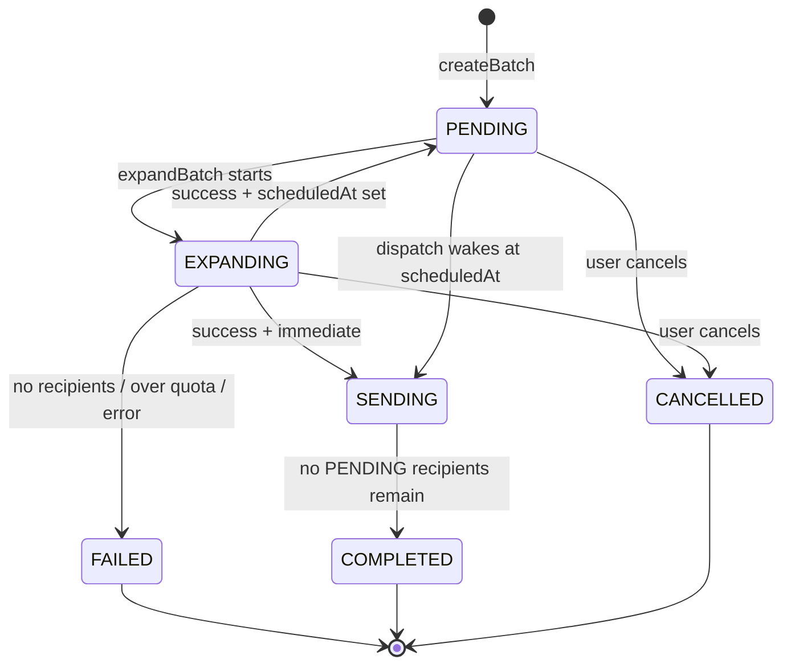
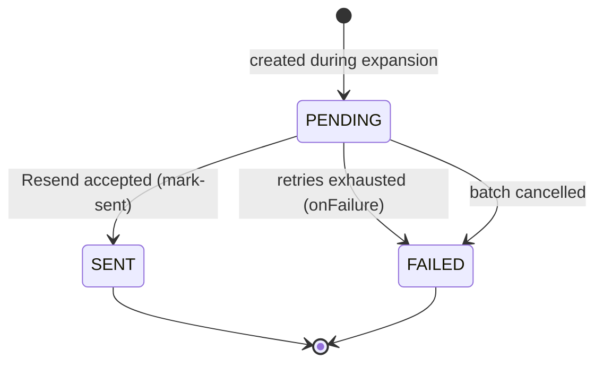

# Email Sending Flow

How an email goes from a user pressing **Send** to landing in an inbox — every
stage, every status change, and what happens when things fail.

> **Provider note.** The bulk-campaign sender delivers through **Resend**
> (`src/lib/resend.ts`), orchestrated by **Inngest** background functions.
> Nylas in this codebase powers the *inbox/calendar* feature, which is a
> separate path and **not** part of this flow.

---

## 1. The cast

| Layer | File | Responsibility |
|-------|------|----------------|
| Server function | `src/features/email-schedule/api/server.ts` | Auth + Zod validation, then delegates. No business logic. |
| Service | `src/features/email-schedule/api/service.ts` | Business rules: dedup, quota reservation, status orchestration, handoff to Inngest. |
| Repository | `src/features/email-schedule/api/repository.ts` | All Prisma / raw-SQL data access. No auth, no business rules. |
| Inngest functions | `src/features/email-schedule/inngest/functions.ts` | Background dispatch + per-recipient send, with retries, throttling, and finalization. |
| Resend client | `src/lib/resend.ts` | The actual email delivery API. |
| Inngest client + events | `src/lib/inngest.ts` | Event payload types (`BatchCreatedData`, `RecipientSendData`). |

### Data model touched

| Table | Role |
|-------|------|
| `EmailBatch` | One row per send. Holds subject/body, schedule, status, and counters (`totalRecipients`, `sentCount`, `failedCount`). |
| `EmailBatchSource` | The raw inputs the user chose (collections + individual addresses) before expansion. |
| `EmailSchedule` | One row **per recipient** after expansion. The unit of work the sender operates on. |
| `EmailUserUsage` | Per-user, per-period quota counter (`reserved`, `settled`). The cap is enforced here. See [§7](#7-quota-accounting). |
| `EmailSendLedger` | Append-only journal — one row per successful send. Audit / reconciliation source of truth. |

---

## 2. Bird's-eye view



---

## 3. Stage-by-stage

### Stage 0 — User initiates

The user composes a message and chooses recipients as a mix of **collections**
(saved contact lists) and **individual** addresses. They either **Send All**
(immediate) or **Schedule** for a future time.

This becomes a `createEmailBatch` call whose `sources` is an array of:

```ts
| { type: "COLLECTION";  collectionId: string }
| { type: "INDIVIDUAL"; email: string; name?: string }
```

`scheduledAt = null` → send now. A future ISO date → schedule.

### Stage 1 — Server function (`server.ts`)

`createEmailBatch`:
1. `requireUserId()` — must be authenticated.
2. `createEmailBatchSchema.parse(data)` — Zod validation; rejects bad input.
3. Delegates to `service.createBatch(userId, data)`.
4. Returns the consistent `{ data }` shape.

### Stage 2 — Create the batch (`service.createBatch`)

- If `scheduledAt` is in the **past** → throws `SCHEDULE_IN_PAST`.
- Persists the `EmailBatch` (status starts at **PENDING**) plus its
  `EmailBatchSource` rows.
- Calls `expandBatch(...)` synchronously, then returns `{ id, status }`.

### Stage 3 — Expansion (`service.expandBatch`)

This is where raw sources become concrete recipients. Status → **EXPANDING**.

1. **Resolve & dedup.** Walk every source:
   - `COLLECTION` → look up contact IDs, fetch their emails (via the collections
     repository).
   - `INDIVIDUAL` → use the address directly.
   - All recipients go into a `Map` keyed by email, so **duplicates across
     collections and individual entries collapse to one** (first occurrence
     wins, which is why a collection entry beats a later individual entry).
2. **Empty guard.** If zero recipients resolved → status **FAILED**, stop.
3. **Materialize.** Insert one `EmailSchedule` row per recipient (each starts
   **PENDING**) and write `totalRecipients`.
4. **Quota reservation** (the cap gate — see [§7](#7-quota-accounting)):
   - Look up the user's plan + billing-period anchor.
   - `ensureUsageRow` then `reserveQuota(userId, periodStart, created, cap)` —
     an **atomic** conditional `UPDATE`. If it would exceed the cap it returns
     false → status **FAILED** + throws `QUOTA_EXCEEDED`.
   - On success the period the reservation was made against is remembered so the
     sender settles/releases the *same* row.
5. **Decide next status & hand off.**
   - `scheduledAt` set → **PENDING** (waiting for its time).
   - immediate → **SENDING**.
   - Publishes the `email/batch.created` Inngest event, carrying
     `{ batchId, userId, tier, periodStart }`.

> If **anything** in expansion throws *after* a successful reservation but
> *before* dispatch, the `catch` **releases** the reserved quota (nothing was
> sent) and marks the batch **FAILED**.

### Stage 4 — Dispatch (`dispatchBatch`, Inngest)

Triggered by `email/batch.created`:
1. Load the batch (skip if it vanished).
2. If `scheduledAt` is in the future → `step.sleepUntil(...)` holds the run open
   until then.
3. Load all **PENDING** recipient IDs.
   - If **none** → mark batch **COMPLETED**, done.
4. **Fan out**: emit one `email/recipient.send` event per recipient, each
   carrying `{ batchId, recipientId, userId, tier, periodStart }`.

### Stage 5 — Per-recipient send (`sendEmailToRecipient`, Inngest)

One run per recipient. Scaling controls are declared on the function:

| Control | Behaviour |
|---------|-----------|
| **Throttle** | `RESEND_RPS`/sec. Free users **share** one bucket (`tier:FREE`); each paid user gets their own (`user:<id>`) so they don't share budget with the free pool. |
| **Concurrency** | Global cap of 50 parallel sends (protects the Resend API) **and** a per-user cap of 10 (fairness — one user can't hog all workers). |
| **Priority** | Paid events (`100`) leapfrog free events (`0`) under contention. |
| **Retries** | Up to **3** on transient errors before `onFailure` fires. |

The handler:
1. Load the recipient. If it's **not PENDING** anymore (already sent / cancelled)
   → return early (**idempotent** — safe against duplicate events/retries).
2. Load the parent batch (resolve merge tags into the HTML).
3. `send-via-resend` step: send via Resend with `cc`/`bcc` if present. A Resend
   error (or missing `RESEND_FROM_EMAIL`) throws → triggers a retry.

### Stage 6 — Settlement (`mark-sent` step)

On a successful send, in one step:
- `markRecipientSent` → recipient **SENT**.
- `incrementBatchCounters(batchId, 1, 0)` → `sentCount += 1`.
- `appendLedgerRow` → immutable audit entry in `EmailSendLedger`.
- `settleQuota(userId, periodStart, 1)` → `EmailUserUsage.settled += 1` (the
  billable number). The slot was already reserved, so this never changes the cap.

### Stage 7 — Finalize (`maybeFinalizeBatch`)

After each recipient finishes (sent **or** failed), check whether any **PENDING**
recipients remain. If none → batch **COMPLETED**. Idempotent: concurrent
finishers calling it is harmless.

---

## 4. Failure & fallback paths

| Failure | What happens |
|---------|--------------|
| Scheduled time in the past | `createBatch` throws `SCHEDULE_IN_PAST`; nothing persisted beyond validation. |
| Zero recipients after dedup | Batch → **FAILED** during expansion. No reservation made. |
| Over quota | `reserveQuota` returns false → batch **FAILED** + `QUOTA_EXCEEDED`. No event published, nothing sent. |
| Error during expansion (after reserve) | `catch` **releases** the reservation + batch **FAILED**. |
| Transient send error | Inngest retries the recipient up to **3×**. |
| Send fails after all retries | `onFailure`: recipient **FAILED** (reason stored, truncated to 500 chars), `failedCount += 1`, **release** that recipient's reserved slot (`reserved -= 1` so it isn't billed or counted against the cap), then finalize. |
| Duplicate / replayed event | Handler returns early if the recipient is no longer PENDING — no double send. |

**Reserve-on-failure safety:** `releaseQuota` floors at zero (`GREATEST(... ,0)`),
so a double-release can never drive the counter negative. The trade-off (chosen
deliberately, no reconciler): a crash *between* a send failing and its release
committing leaks a reservation — this fails **safe** (the user hits their cap
slightly early; they are never over-billed, since billing reads `settled`).

---

## 5. Batch state machine (`EmailBatchStatus`)



| Status | Meaning |
|--------|---------|
| `PENDING` | Created; either freshly inserted or expanded-and-waiting for `scheduledAt`. |
| `EXPANDING` | Resolving sources into recipient rows + reserving quota. |
| `SENDING` | Recipients are being dispatched/sent. |
| `COMPLETED` | All recipients are terminal (sent or failed). |
| `FAILED` | Expansion failed, hit the quota cap, or errored before dispatch. |
| `CANCELLED` | User cancelled while still `PENDING`/`EXPANDING`. |

## 6. Recipient state machine (`EmailRecipientStatus`)



| Status | Meaning |
|--------|---------|
| `PENDING` | Awaiting send. |
| `SENT` | Resend accepted it; ledger + `settled` updated. |
| `FAILED` | All retries exhausted, or its batch was cancelled (`failureReason` set). |

---

## 7. Quota accounting

Two tables cooperate; they are **not** duplicates:

- **`EmailUserUsage`** — the live counter the cap is enforced against.
  - `reserved` = in-flight **+** sent (what the cap is checked against).
  - `settled` = confirmed sends (what billing reads).
- **`EmailSendLedger`** — the append-only receipt book for audit / reporting /
  reconciliation. `settled` should always equal the ledger SUM for the period;
  if they ever diverge, the ledger wins.

Lifecycle of one email's quota:

| Event | `reserved` | `settled` |
|-------|-----------|-----------|
| Expansion (per batch) | `+= N` (atomic gate) | — |
| Each successful send | — | `+= 1` |
| Each failed send | `-= 1` (release) | — |
| Whole batch fails before dispatch | `-= N` (release) | — |

At rest, `reserved == settled`.

### Why the gate is atomic

The reservation is a **single** SQL statement that checks the cap *and* debits in
one locked operation:

```sql
UPDATE "EmailUserUsage"
SET "reserved" = "reserved" + :n
WHERE "userId" = :u AND "periodStart" = :p
  AND "reserved" + :n <= :cap;   -- 0 rows updated => over cap
```

Postgres takes a row lock, so two batches expanding at once **serialize** on that
row instead of both reading a stale value and overshooting the cap (a TOCTOU
race). This is why these functions use raw SQL — Prisma's fluent API can't
express a `WHERE` that compares `column + value <= cap`.

---

## 8. Cancellation

`cancelEmailBatch` → `service.cancelBatch` → `repo.cancelBatch`:
- Only batches still in **PENDING** or **EXPANDING** can be cancelled; otherwise
  `BATCH_NOT_FOUND_OR_NOT_PENDING`.
- In one transaction: batch → **CANCELLED**, and all still-**PENDING**
  `EmailSchedule` rows → **FAILED** with reason `"Batch cancelled"`.

> **Known edge case.** A *scheduled* batch that's cancelled while `dispatchBatch`
> is sleeping will, on wake, find zero PENDING recipients and run the
> `mark-completed` branch — flipping the batch from `CANCELLED` to `COMPLETED`.
> Quota was released by the cancel (recipients FAILED never settle). If this
> matters, guard the wake path to skip non-`PENDING`/`SENDING` batches.

---

## 9. Configuration & feature gating

| Env var | Purpose |
|---------|---------|
| `RESEND_API_KEY` | Resend auth (read at module load — restart dev server after changing). |
| `RESEND_FROM_EMAIL` | Verified sender address. Missing → sends throw a non-retriable error. |
| `RESEND_RPS` | Per-second send cap for the Inngest throttle. Match your Resend plan (free 2, pro 10, scale 100+). |

Plan caps live in `src/lib/quota.ts` (`MONTHLY_SEND_QUOTA`); the billing period
is anchored to each user's `subscriptionStartedAt` and rolls over automatically
(no reset job).

---

## 10. File map

```
src/features/email-schedule/
├── api/
│   ├── server.ts      # createEmailBatch, getEmailBatches, cancelEmailBatch, ...
│   ├── service.ts     # createBatch, expandBatch, cancelBatch, list/get
│   └── repository.ts  # Prisma + raw-SQL: recipients, counters, quota (reserve/release/settle), ledger
├── inngest/
│   └── functions.ts   # dispatchBatch, sendEmailToRecipient (+ onFailure), maybeFinalizeBatch
└── types.ts           # Zod schemas + TS types
src/lib/
├── inngest.ts         # Inngest client + event payload types
├── resend.ts          # Resend client + RESEND_* config
└── quota.ts           # MONTHLY_SEND_QUOTA + currentPeriodStart
prisma/schema.prisma   # EmailBatch, EmailBatchSource, EmailSchedule, EmailUserUsage, EmailSendLedger
```
